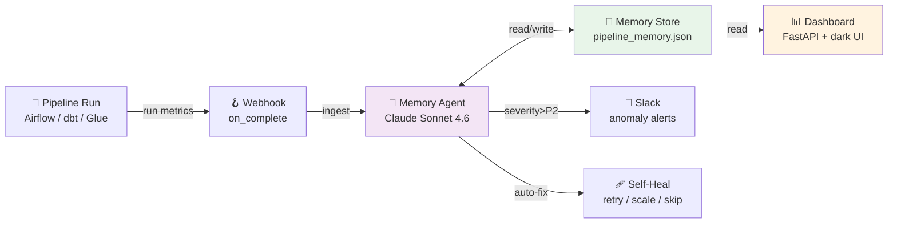
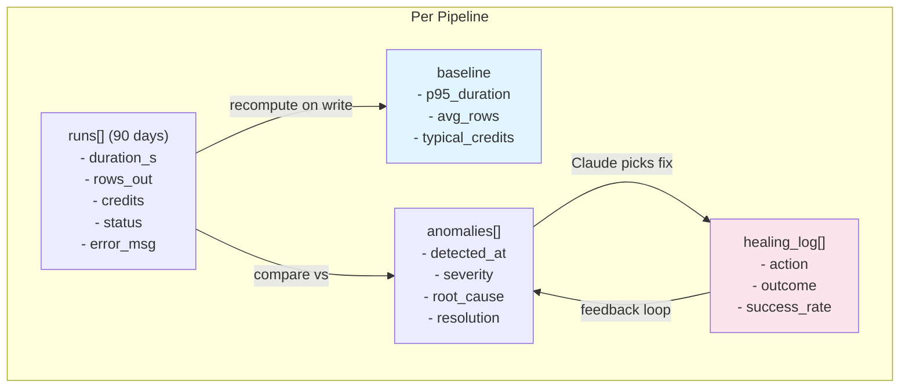
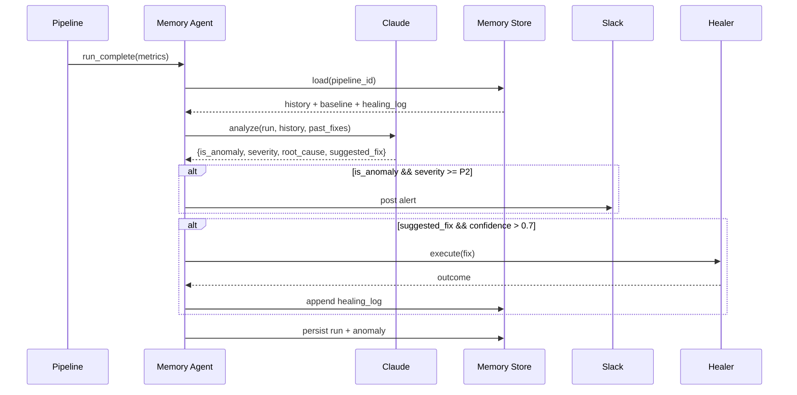

# Pipeline Memory Agent — Architecture

Claude-powered agent with persistent pipeline memory, anomaly detection, and self-healing.

## System Flow

## Memory Model

## Agent Decision Loop

## Dashboard Routes

| Route | Purpose |
|-------|---------|
| `GET /` | HTML dashboard with pipeline health cards |
| `GET /api/health` | Service health check |
| `GET /api/pipeline/{id}` | Run history + baseline for one pipeline |
| `GET /api/anomalies` | All detected anomalies across pipelines |
| `GET /api/heals` | Self-healing action log |
| `GET /metrics` | Prometheus metrics for scraping |

## Tech Stack

| Layer | Technology |
|-------|------------|
| LLM | Anthropic Claude Sonnet 4.6 |
| Storage | JSON (append-only per pipeline) |
| API | FastAPI, Pydantic v2 |
| UI | Server-rendered HTML + Tailwind-like dark theme |
| Metrics | prometheus-client |
| Testing | pytest, pytest-asyncio |

## Why JSON (not a database)?

- **Portability** — zero infra, single file per deployment
- **Git-diffable** — memory changes are reviewable in PRs
- **Fast enough** — <10K runs per pipeline fits in memory
- **Easy migration** — swap to SQLite/Postgres later behind `MemoryStore` interface
